# Walkthrough of the main flows

This walks the main flows step by step. Each step links to the frame that
draws it. The frames are in `images/`. Every frame carries its option id (for
example `3b`) and a note under the screen with the exact copy and the rules.

All people, hosts and keys are sample data. The server is
`signalhub.example`. The only key is `shpk1_EXAMPLEKEY-not-a-real-key-0000`.
The host is the person who runs the server.

The clickable prototypes (`Prototype - App` and `Prototype - Web`) are in the
Claude Design project, linked from [README.md](README.md). They walk the same
flows with the same copy. They are not images, so they are not exported.

Contents:

1. [A person's first run](#1-a-persons-first-run)
2. [A new producer and its key](#2-a-new-producer-and-its-key)
3. [An admin invites someone, changes their role and revokes a device](#3-an-admin-invites-someone-changes-their-role-and-revokes-a-device)
4. [A Mod's devices and signing in a browser](#4-a-mods-devices-and-signing-in-a-browser)
5. [What's new](#5-whats-new)
6. [Web sign-in on a desktop and on a phone](#6-web-sign-in-on-a-desktop-and-on-a-phone)
7. [An ended session](#7-an-ended-session)
8. [The choices and their alternatives](#8-the-choices-and-their-alternatives)
9. [What the server must provide](#9-what-the-server-must-provide)
10. [What was left out](#what-was-left-out)

## 1. A person's first run

Rui is invited by an admin. Rui starts with nothing: no events, no producers,
and no idea what SignalHub is. The flow takes Rui from the invitation to a
first subscription. Screens before the app is connected have no bottom bar.

1. **Setup.** Rui opens the app and sees *Connect to SignalHub*. The camera
   scans the invitation code. *Paste link* is the keyboard and TalkBack path.
   A code works once and for a few minutes. 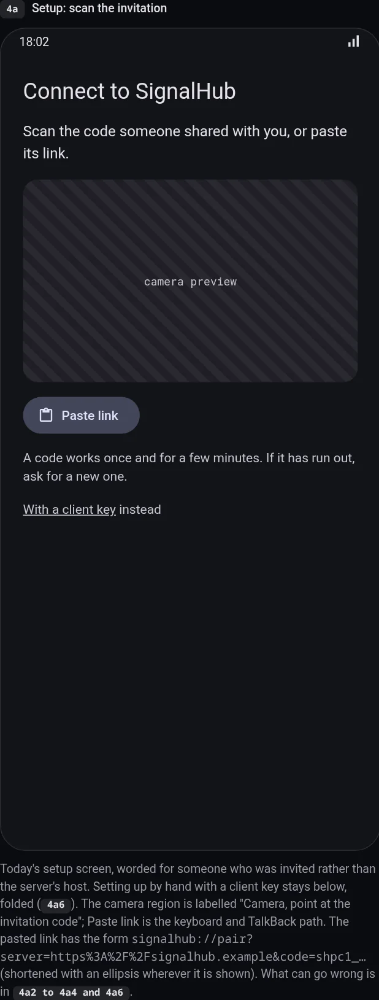
2. **When setup fails.** Each failure says what happened and what to do, in one
   sentence, and leaves the scanner usable.
   - Camera not allowed: [4a2](images/first-run/4a2-camera-not-allowed.webp)
   - A link that is not an invitation: [4a3](images/first-run/4a3-code-that-isnt-invitation.webp)
   - The server cannot be reached: [4a4](images/first-run/4a4-cant-reach-server.webp)
   - A client key instead, and a wrong key: [4a6](images/first-run/4a6-client-key-wrong-key.webp)
   - A code that does not work. The server answers every failed code the same
     way, so one line covers expired, used and unknown codes: [4e](images/first-run/4e-code-that-doesnt-work.webp)
3. **Welcome, once.** The welcome names the server and the device, says what
   producers and the inbox are, and says `The host runs this server and can
   see every event on it.` *Find producers* opens the Producers tab. *Later*
   opens the inbox. 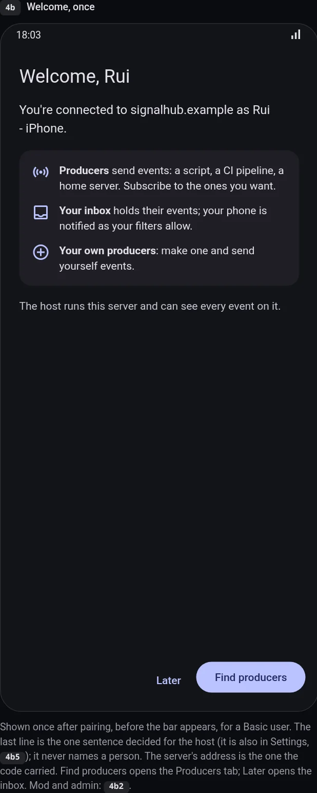
   An admin's or a Mod's welcome adds role facts: [4b2](images/first-run/4b2-welcome-admins-device.webp)
4. **An empty inbox.** It points to the one thing that fills it. 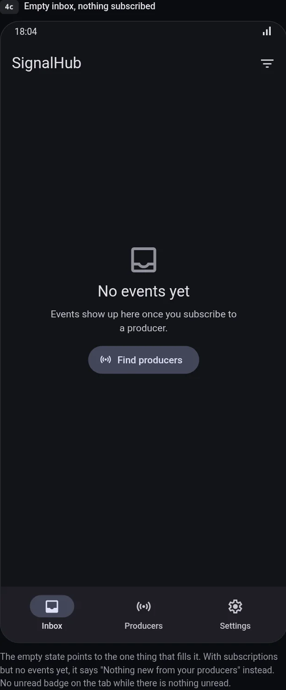
5. **Producers.** The Producers tab has search and filter chips. With nothing
   to show, it says so and offers the one action that fills it.
   - No producers at all: [4d](images/first-run/4d-producers-none-all-yet.webp)
   - Nothing under Yours: [4g](images/first-run/4g-producers-nothing-under-yours.webp)
   - Nothing under Can subscribe: [4h](images/first-run/4h-producers-nothing-under-can-subscribe.webp)
6. **Subscribing.** With producers, the list is grouped Yours, Subscribed, Can
   subscribe, each A to Z. The bell subscribes in place. 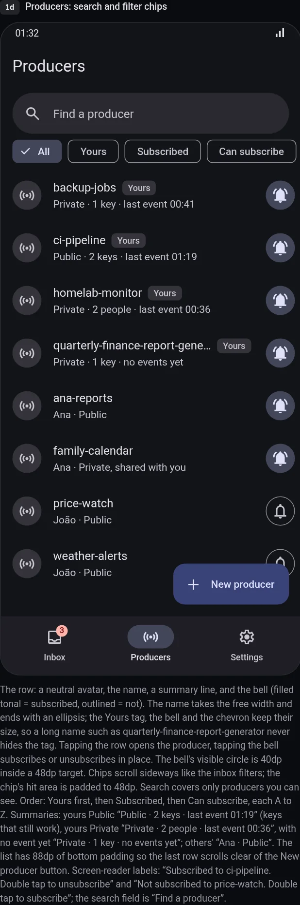
   - The row in each state: [1g](images/producers/1g-row-each-state.webp)
   - In flight: [1h](images/producers/1h-subscribing-flight.webp)
   - It failed (snackbar with Retry): [1i](images/producers/1i-subscribing-it-failed.webp)
   - Unsubscribed (snackbar with Undo): [1j](images/producers/1j-unsubscribed-undo.webp)
   - Someone else's producer, not subscribed yet: [2g1](images/new-producer-key/2g1-not-subscribed-yet.webp)
   - Its events: [1l](images/producers/1l-events-ci-pipeline.webp), and none yet: [1m](images/producers/1m-no-events-from-it-yet.webp)
7. **If the device is later removed.** The app clears its connection and says,
   neutrally: `This device is no longer connected to SignalHub. To use it again,
   ask for a new code, or ask the host.` 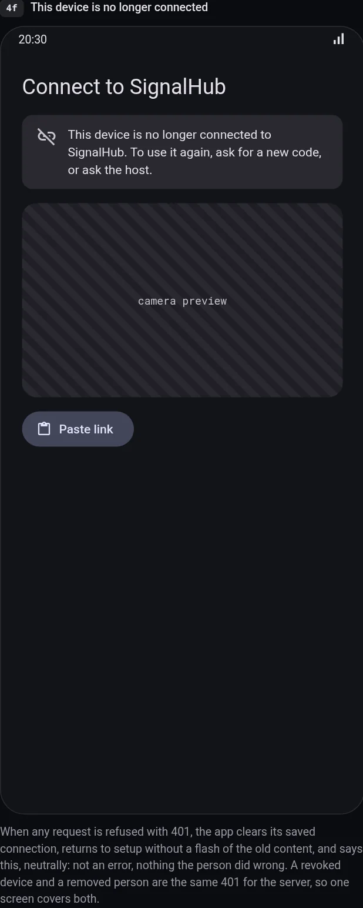

## 2. A new producer and its key

A producer is anything that sends events: a script, a CI pipeline, a home
server. It gets its own key. The key exists in clear text once.

1. **Open Producers and tap New producer.** 
2. **Name it and choose who can see it.** New producers start Private. The help
   text follows the server's rule: letters, digits and `. _ : / -`, up to 100
   characters. 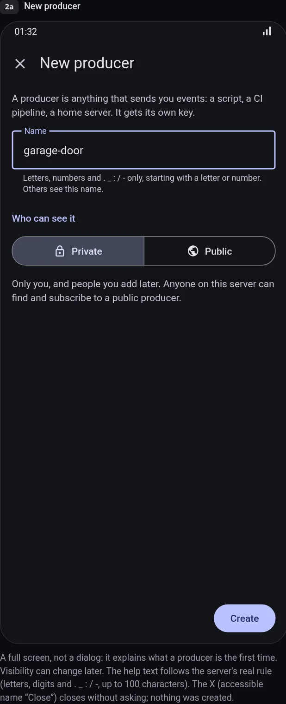
   - The name is taken: [2a1](images/new-producer-key/2a1-create-name-taken.webp)
   - The name is not allowed: [2a2](images/new-producer-key/2a2-create-name-not-allowed.webp)
3. **The key, shown once.** A full screen with Copy, Share, a warning and a
   send example. *Copy and close* copies the key and goes to the producer's
   screen. 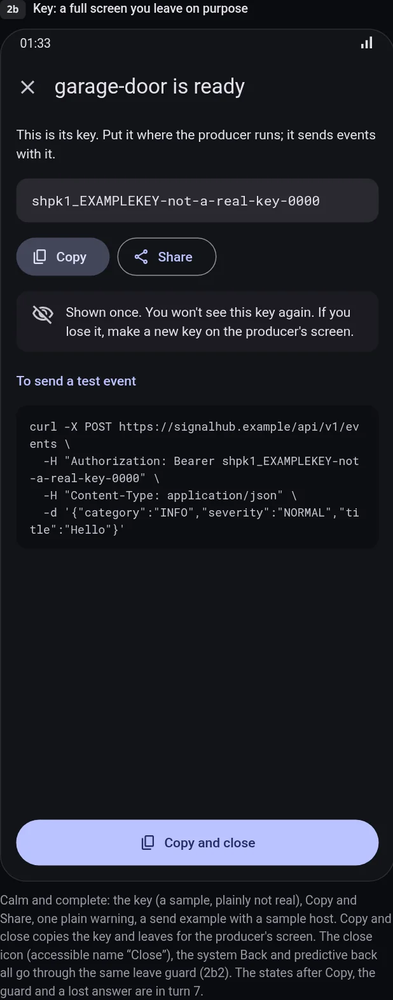
   - After Copy, `Copied` stays while the screen is open: [2b1](images/new-producer-key/2b1-after-copy.webp)
   - Back before copying asks once: [2b2](images/new-producer-key/2b2-back-before-copying.webp)
   - The answer was lost, so Create again: [2b3](images/new-producer-key/2b3-answer-was-lost-create-again.webp)
   - A producer with no key: [2b4](images/new-producer-key/2b4-producer-no-key.webp)
   - A new key for an existing producer: [2b5](images/new-producer-key/2b5-new-key-existing-producer.webp)
   - 360 dp wide at 200% text: [2b6](images/new-producer-key/2b6-360dp-wide-text-200.webp)
   - In the light theme: [5c](images/light-theme/5c-key-shown-once-full-screen.webp)
4. **Send a test event** with the curl example on the key screen. The same
   example is on the web page: [8e](images/web-settings-people/8e-new-key-shown-once-dialog.webp)
5. **The producer's screen.** Rename, subscribed switch, who can see it, keys
   with their prefix, New key, See its events, Disable. 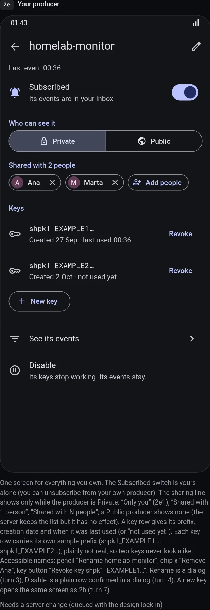
   - Nobody added yet reads `Only you`: [2e1](images/new-producer-key/2e1-your-producer-nobody-added-yet.webp)
   - Add people to a private producer: [2f](images/new-producer-key/2f-add-people-private-producer.webp)
6. **Managing keys and the producer.**
   - Revoke a key (confirm): [2i](images/new-producer-key/2i-revoke-key.webp)
   - Revoke the only working key: [2j](images/new-producer-key/2j-revoke-only-working-key.webp)
   - Disable the producer (confirm): [2k](images/new-producer-key/2k-disable-producer.webp)
   - Remove someone from the list (confirm): [2l](images/new-producer-key/2l-remove-someone-from-list.webp)
   - Public to Private (confirm): [2m](images/new-producer-key/2m-public-private.webp)
   - Every key revoked: [2n](images/new-producer-key/2n-every-key-revoked.webp)
   - Disabled by you: [2o](images/new-producer-key/2o-disabled-by-you.webp)
   - Disabled by the host: [2p](images/new-producer-key/2p-disabled-by-host.webp)
7. **Someone else's producer.** A Get its events switch. 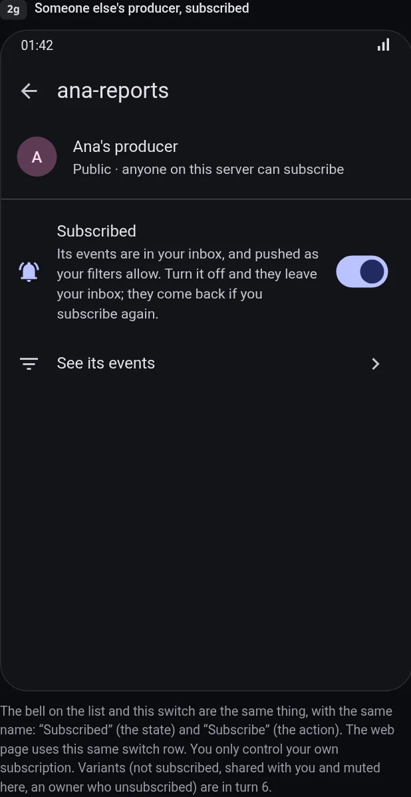

On the web page the same flow is at [7b](images/web-inbox-producers/7b-producers-desktop-search-chips-your.webp) (desktop) and [7f](images/web-inbox-producers/7f-new-producer-phone-width-someone.webp) (phone
width).

## 3. An admin invites someone, changes their role and revokes a device

Rodrigo is an admin. People is the admin's fourth tab.

1. **The bar for an admin.** People is added, and Settings keeps its one order.
   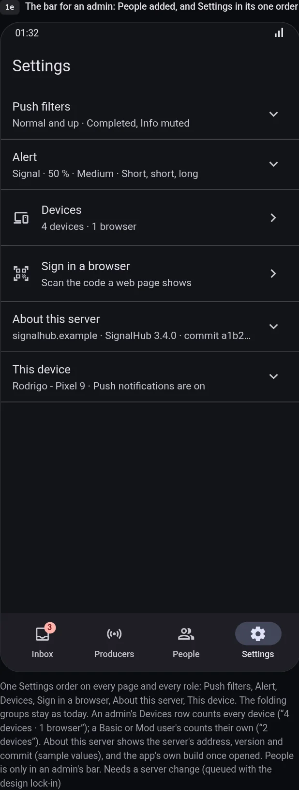
2. **The People tab.** People are in sections by role, each with a one-line
   explanation. A second admin is listed like the first, read only. 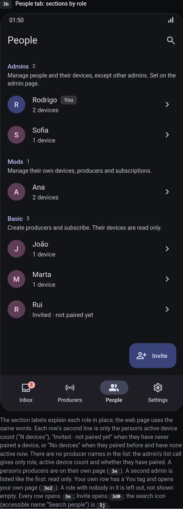
   - 360 dp wide at 200% text: [3b2](images/people-devices/3b2-360dp-wide-text-200.webp)
   - Search and pull to refresh: [3j](images/people-devices/3j-people-search-pull-refresh.webp)
3. **Invite.** The form takes a name, Basic or Mod, and an optional first device
   name. 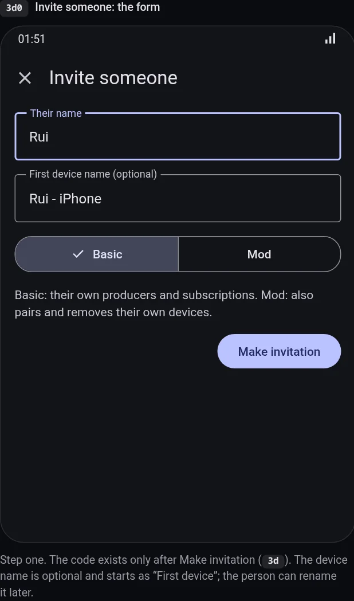
   - The name is taken: [3d2](images/people-devices/3d2-invite-name-taken.webp)
4. **The code.** The pairing QR code, a countdown, the link, Copy link and Share.
   The warning names the person: `Whoever uses this code joins as Rui. Share it
   only with Rui.` 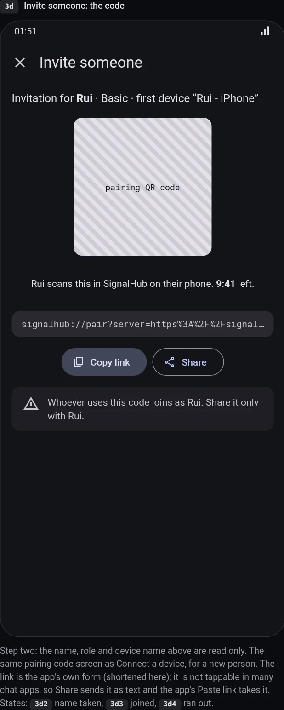
   - Joined: [3d3](images/people-devices/3d3-invite-joined.webp)
   - The code ran out: [3d4](images/people-devices/3d4-invite-code-ran-out.webp)
5. **A person's page.** Role, devices and producers. Admin is shown but disabled.
   It is set on the admin page, on the computer running SignalHub. 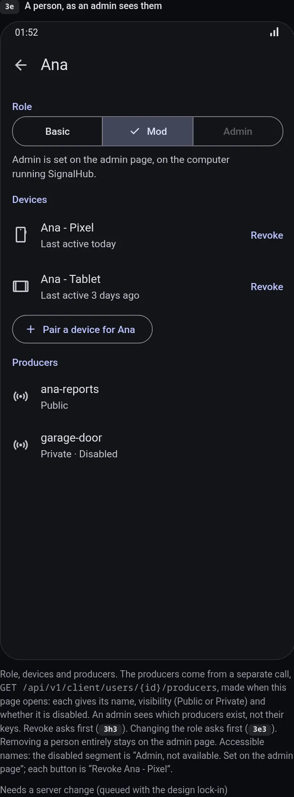
6. **Change the role.** The change asks first and applies on the person's next
   action. A role change sends no push. 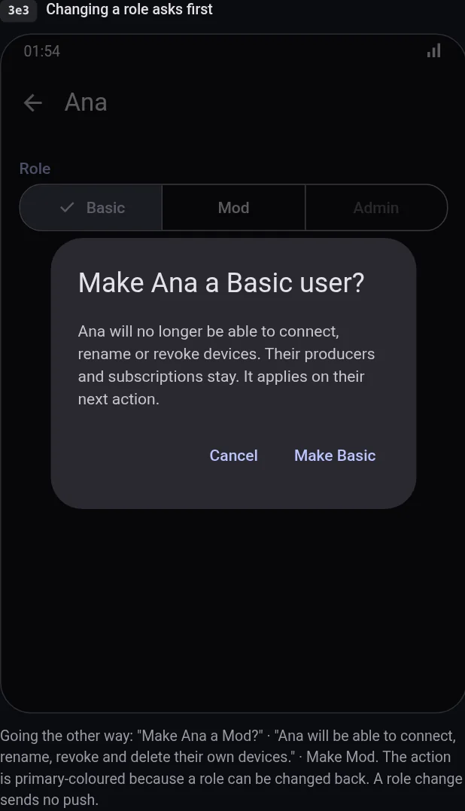
   - Errors, as messages: [3e4](images/people-devices/3e4-role-device-errors-messages.webp)
   - Another admin, read only: [3e2](images/people-devices/3e2-another-admin-read-only.webp)
   - The person was removed: [3e5](images/people-devices/3e5-this-person-was-removed.webp)
   - Your own role changed while the app was open: [3k](images/people-devices/3k-your-role-changed-while-app.webp)
7. **Devices, grouped by person.** An admin sees everyone's devices and revoked
   ones. 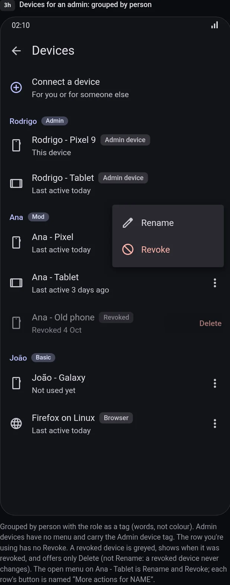
   - Rename: [3h2](images/people-devices/3h2-rename-device.webp)
   - **Revoke.** Not reversible. The dialog names the device and says who is
     told. [3h3](images/people-devices/3h3-revoke-device.webp)
   - Delete a revoked device: [3h4](images/people-devices/3h4-delete-revoked-device.webp)
8. **Connect a device for someone else.** An admin chooses who, types the new
   device's name, and gets the code. 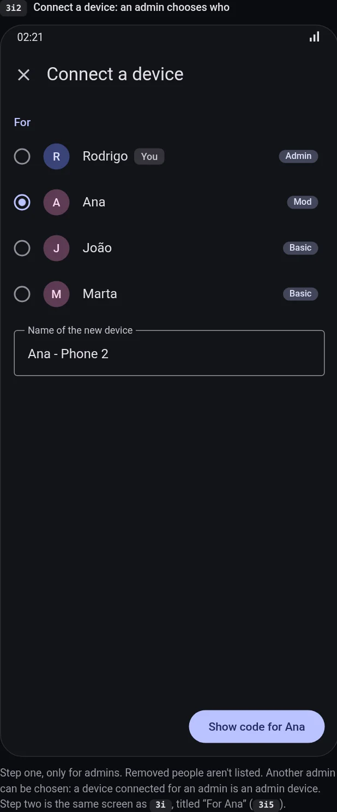
   - The warning for someone else's code: [3i5](images/people-devices/3i5-connect-device-code-someone-else.webp)
   - Used: [3i3](images/people-devices/3i3-connect-device-used.webp)
   - Ran out, and refused: [3i4](images/people-devices/3i4-connect-device-ran-out-refused.webp)

On the web page the same screens are at [8d](images/web-settings-people/8d-people-admins-only-rodrigo-list.webp) (People) and [8c2](images/web-settings-people/8c2-devices-admin-sees-them-rodrigo.webp)
(Devices as an admin sees them).

## 4. A Mod's devices and signing in a browser

Ana is a Mod. A Mod manages their own devices, producers and subscriptions. A
Basic user sees the same Devices screen read only.

1. **Devices.** Their own devices only, browsers included. Rename and Revoke
   are in the row menu. *Connect a device* is at the top. 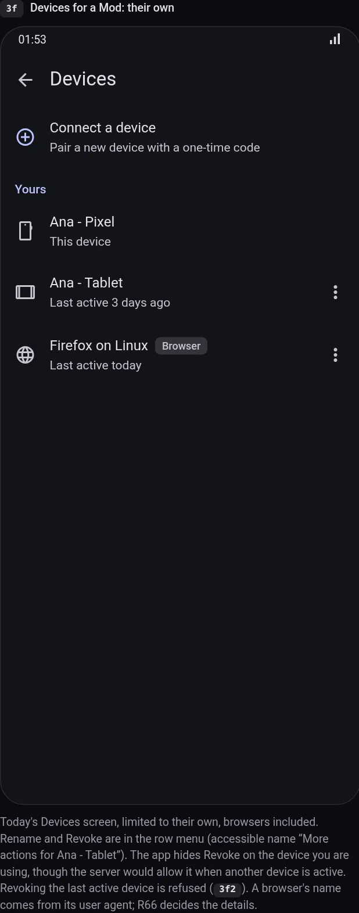
   - The last active device cannot be revoked: [3f2](images/people-devices/3f2-mods-last-active-device.webp)
2. **Connect a device.** Step one types the new device's name. Step two shows
   the code, for Ana, and the warning `Whoever uses this code gets a device of
   yours. Share it only with yourself.`
   - Step one: [3i0](images/people-devices/3i0-connect-device-mod-step-one.webp)
   - The code: [3i](images/people-devices/3i-connect-device-mod-code.webp)
3. **A Basic user's Devices.** Read only. One sentence says who can help:
   `To add or remove a device, ask an admin of this server.` 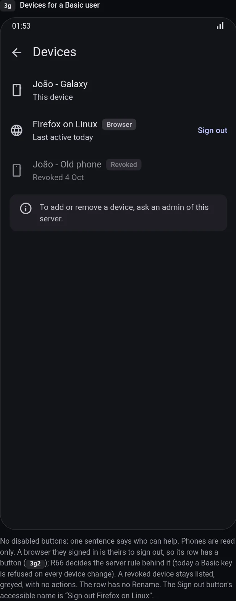
   - A Basic user signs out their own browser: [3g2](images/people-devices/3g2-basic-user-signs-out-their.webp)
4. **Settings has the scanner row.** *Sign in a browser* is a Settings row for
   every role. 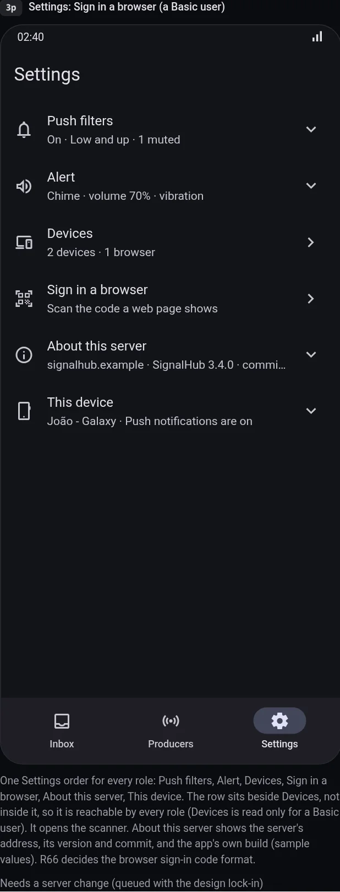
5. **Sign in a browser.** The app scans the code the web page shows. It then
   asks *Sign in this browser?* and names the browser and system, for example
   `Firefox on Linux`. 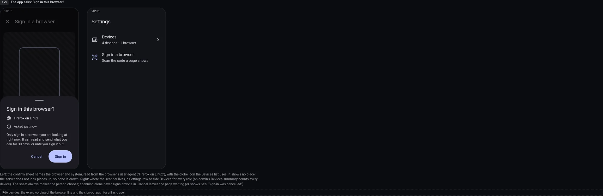

## 5. What's new

A device that was already connected when the app updated sees a card once, at
the top of the inbox. It lists the bottom bar, Producers and, for an admin,
People. *See Producers* opens the tab and dismisses. *Got it* dismisses for
good. A newly connected device gets the welcome instead.

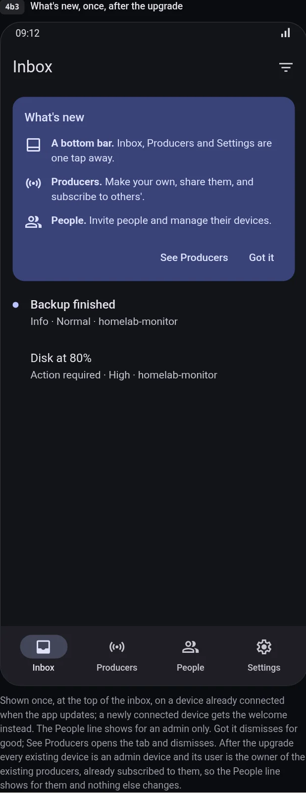

After the upgrade every existing device is an admin device, and its user owns
the existing producers and is subscribed to them.

## 6. Web sign-in on a desktop and on a phone

There are no passwords. A browser becomes one of your devices by being approved
from a device you already have. Every role can do it. A sign-in lasts a fixed
30 days.

### On a desktop

1. **The page waits and the app scans.** The page shows a QR code and a
   countdown. The steps say `Open SignalHub on your phone, go to Settings ›
   Sign in a browser, and scan this code.` 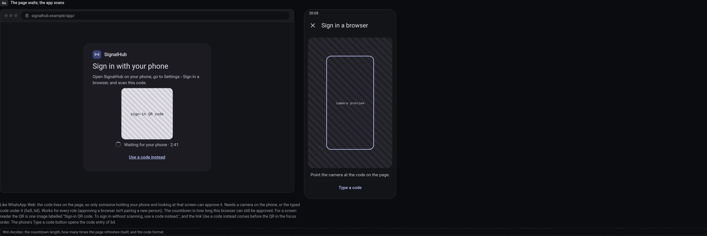
2. **The code expires.** At zero the page swaps in a fresh code by itself.
   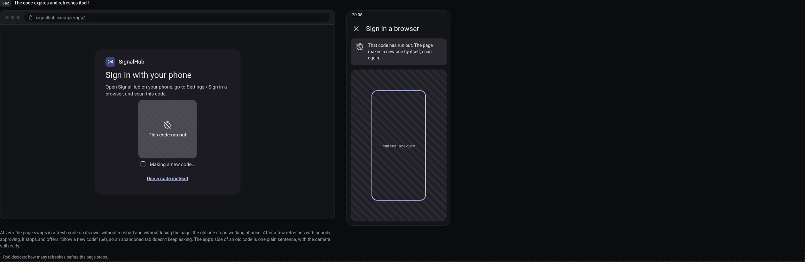
3. **The app asks.** *Sign in this browser?* 
4. **Success.** The page opens the inbox by itself after about a second.
   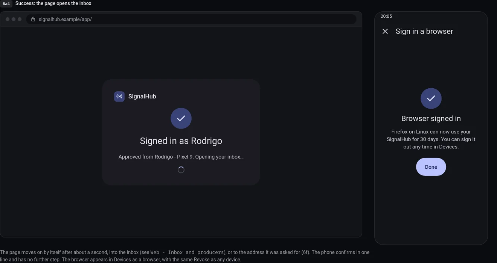
5. **No camera.** *Use a code instead* shows a short code to type in the app.
   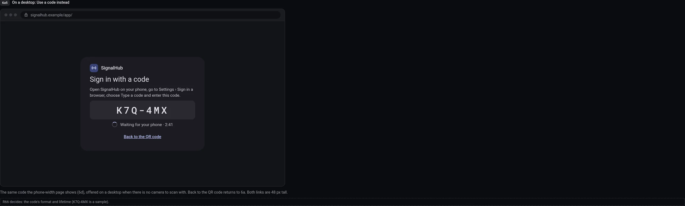
6. **The inbox.** 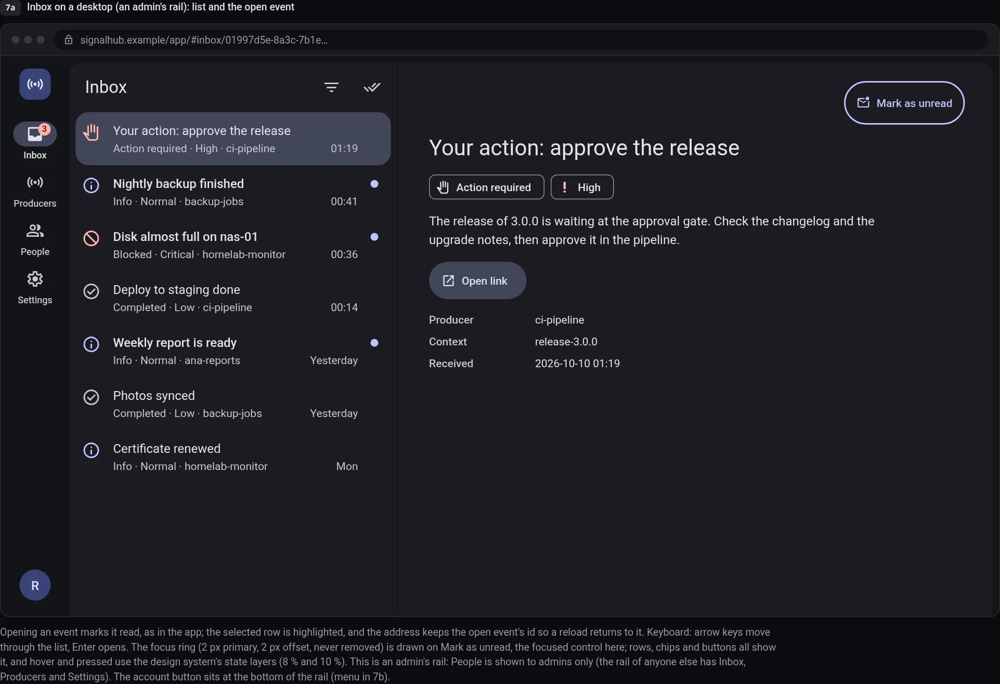
7. **In the light theme:** [6a-l](images/light-theme/6a-l-sign-desktop-browser.webp)

### On a phone

A phone cannot scan its own screen. The page shows a short code to type in the
app, and an *Open the app* button.

1. **The page, the app's code entry and a wrong code.** 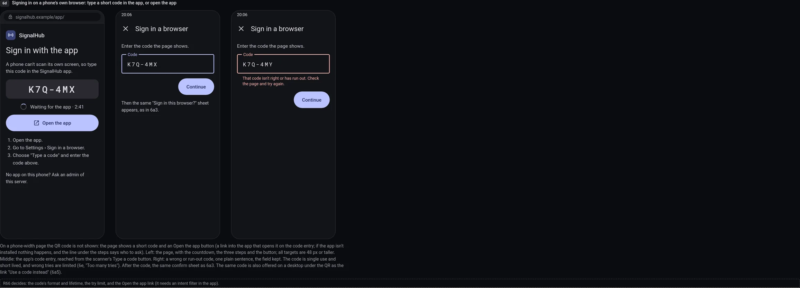
2. **The web page at phone width.** The inbox, with the account button
   ([7c](images/web-inbox-producers/7c-web-page-phone-inbox-account.webp)), and Producers, with the account menu open ([7d](images/web-inbox-producers/7d-web-page-phone-producers-account.webp)).
3. **Something goes wrong.** Cancelled, too many tries, cannot reach the
   server, stopped waiting, already signed in: [6e](images/web-sign-in/6e-when-something-not-right-while.webp)
4. **In the light theme:** [6d-l](images/light-theme/6d-l-sign-phones-own-browser.webp)

## 7. An ended session

A session ends after 30 days, when the browser is revoked from Devices, or when
the person signs out in another tab.

1. **The page keeps the address.** The page shows `Your sign-in ended.` with a
   *Sign in again* button. After signing in, the person comes back to the page
   they were on. A revoked browser gets the neutral *You're signed out* page.
   A sign-out in another tab shows a banner. 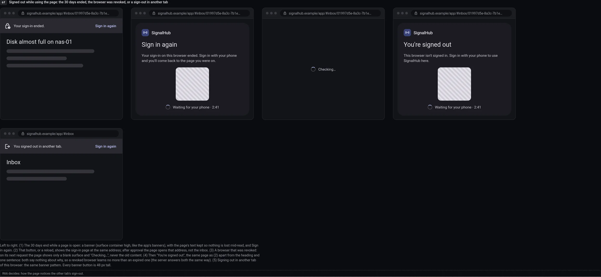
2. **Signing out on purpose.** The dialog says `This browser stops being a
   device of yours. Your phone and your other devices are not affected.`
   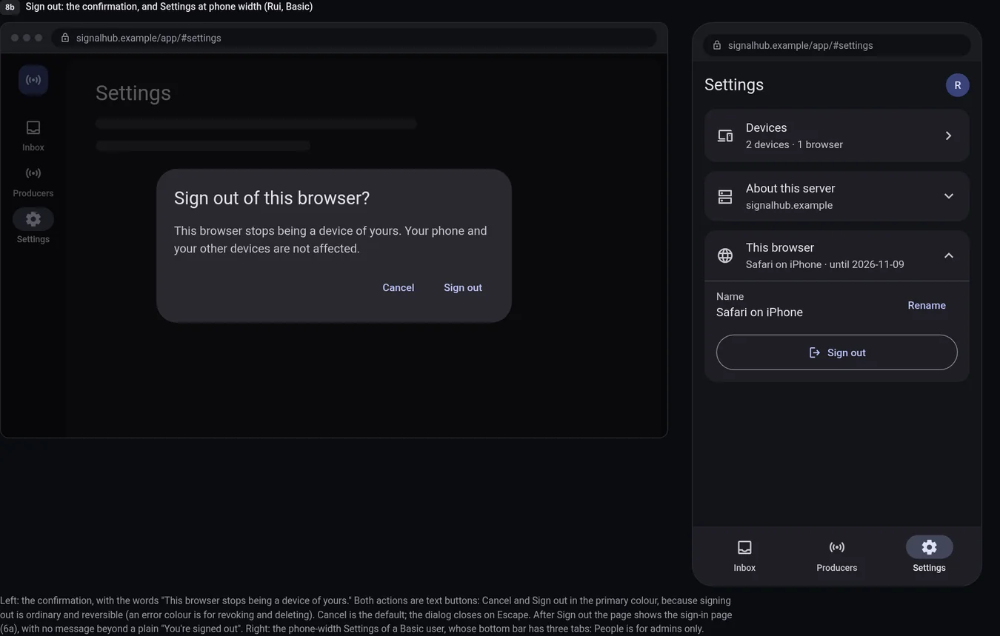
3. **Revoking a browser from Devices.** [8c](images/web-settings-people/8c-devices-rui-basic-browsers-carry.webp), and in the light theme
   [8c-l](images/light-theme/8c-l-revoke-browser-confirmation-web-page.webp).
4. **A banner in light:** [6f-l](images/light-theme/6f-l-web-banner-sign-ended-offline.webp)

## 8. The choices and their alternatives

### 8.1 The owner's picks

| Choice | Picked | Alternatives | Why (from the comparison pages) |
| --- | --- | --- | --- |
| Navigation | **A: a bottom bar** (Inbox, Producers, Settings; People for an admin) | **B:** today's app bar with the gear, Producers as a pushed screen, and Settings rows for Producers, People and Devices | The owner chose A. Producers and People are used often, so they are one tap away. B kept the app as it is but buried them. The design system's old "no bottom navigation" pattern was replaced. |
| Producers | **1d: search plus filter chips** (All, Yours, Subscribed, Can subscribe) | **1b:** a segmented button (Subscribed, Mine, Browse). **1c:** one list in sections (Yours, Subscribed, You can subscribe to) with a New producer button | The owner chose 1d. One list serves a few producers and many. Search and chips scale to many. The empty states stay the same shape as producers arrive. |
| The key shown once | **2b: a full screen** with Copy, Share and a send example, plus 2c's *Copy and close* button | **2c:** a bottom sheet. **2d:** a card on the producer's screen that stays until hidden | The owner chose 2b. A key that cannot be seen again should not sit in a dismissible sheet. A full screen you leave on purpose cannot be lost by a stray tap. *Copy and close* comes from 2c. |
| People | **3b: sections by role**, each explaining the role | **3a:** a flat list with role tags and an Invite button. **3c:** folding groups with the role control and devices in place | The owner chose 3b. The section label teaches what each role can do in place, and the web page uses the same words. |
| Web sign-in | **6a: the page shows a QR code that the app scans** | **6b:** a short code typed in the app. **6c:** type your name and approve a push with number matching | The owner chose 6a. The code lives on the page, so only someone holding the phone and looking at the screen can approve it. 6c is riskier on a public page. 6b stays as the typed-code path (6a5, 6d). |

The options that were not picked were removed from the project once the owner
chose.

### 8.2 The owner's answers to Q1 to Q10

After the first drawings, a gap list raised ten questions. The owner answered
"all as recommended", changing Q8.

| Q | Question | Answer |
| --- | --- | --- |
| Q1 | What may an admin see of other people? | A small admin-only API addition (R68): each user's role, device count, whether they have paired a device yet, and their producers. The designs may show these to admins. |
| Q2 | May a Basic user sign in a browser? | Yes. A Basic user approves signing in a browser from their own device, and signs out or revokes their own browsers. They still cannot pair or remove phones. *Sign in a browser* is a Settings row for every role. |
| Q3 | Signing in on a phone's browser | A short code typed in the app, plus an *Open the app* button (6d). |
| Q4 | Losing access to a producer | It disappears from the list. No notice. |
| Q5 | Does an owner see who subscribed? | No. The producer's screen shows only `Shared with N people`. |
| Q6 | Existing devices after the upgrade | A one-time What's new card (bottom bar, producers, people). |
| Q7 | Pausing a producer | Disable only: `Its keys stop working. Its events stay.` The leak of global names is accepted. |
| Q8 | How the server's operator is named | Changed from the recommendation. The wording is `The host runs this server and can see every event on it.` in the welcome and in Settings › About this server. Never the owner's name. |
| Q9 | Who to ask for help | `Ask an admin of this server.` |
| Q10 | How long a web sign-in lasts | A fixed 30 days. Revoking the browser from Devices signs it out. |

### 8.3 The six later decisions

After the review, the owner accepted six recommendations.

1. **The send example is a curl call in the app too**, matching the web page.
   The `signalhub` command needs the Python package, but curl needs nothing.
   It is also producer-agnostic.
2. **The undo-or-confirm table is as drawn.** See `DESIGN.md`, section 4.1.
3. **Device notices open the Devices screen.** An event push still opens the
   event. Every role has a Devices screen, read only for a Basic user.
4. **Producers are grouped Yours, Subscribed, Can subscribe**, each A to Z.
5. **Someone else's disabled producer shows `Disabled`**, not "Paused by its
   owner". The app cannot tell who disabled it.
6. **The full web page works at phone width**, with the app's layout and bottom
   bar. The web page never notifies.

### 8.4 Other decisions made during review

- **Truth over wish.** Where a design showed data the server does not give, the
  design changed. See [What was left out](#what-was-left-out).
- **Destructive dialog actions are an error-coloured text button**, on the app
  and the web page. Never a red filled button.
- **A browser is a device row** with the `language` icon and a `Browser` tag.
- **`Only you`** replaces "Shared with 0 people".
- **Personas are consistent per page.** The host is "the host". On the web,
  admin flows sign in as Rodrigo (Admin) and non-admin flows as Rui (Basic),
  never mixed in one frame.
- **Bottom-bar labels never wrap.** At large text sizes their text scale is
  capped at about 1.3x.
- **The web page's Settings has no *Sign in a browser* row.** A browser cannot
  scan another browser's code. Signing in is approved from the app.
- **Sample keys look obviously fake** and are short.

## 9. What the server must provide

### 9.1 R68, done

R68 added two admin-only calls under `/api/v1/client/`. The designs show only
what they give.

- `GET /api/v1/client/users` gives each person a role, an active device count
  and whether they have paired a device yet. It gives no joined date, no
  producers and no last-seen. That is why a People row says `2 devices`,
  `Invited · not paired yet`, or `No devices`.
- `GET /api/v1/client/users/{id}/producers` gives each producer's id, name,
  visibility and whether it is disabled. An admin sees which producers exist,
  not their keys.

### 9.2 R69, queued

R69 is a server item queued with the design lock-in. It restores three details
that the designs show. They carry a "Needs a server change" note in the frames.

- Devices show `Last active …` (the time of the last request).
- A producer's keys show `Last used …` or `Not used yet` (the last event sent
  with that key).
- About this server shows the server's version and commit
  (`Server: SignalHub 3.4.0 · commit a1b2c3d`, a sample), from the client API.

### 9.3 What R66 decides

R66 builds the web page. The frames carry an "R66 decides" note where the
design leaves a detail to it.

- The browser sign-in code: its format (`K7Q-4MX` is a sample), its lifetime,
  the countdown length, how many times the page refreshes itself, and the
  limit on wrong tries.
- The *Open the app* link. It needs an intent filter in the app.
- The server's rule for a Basic user approving and signing out their own
  browsers. Today a Basic key is refused on every device change.
- How the page notices a Cancel in the app.
- How a browser is named from its user agent, and the sign-out path.
- How fonts and icons are bundled. The page must bundle its own fonts and icons
  and use only its own scripts.

Items the app already uses from today's server, such as pairing codes and
revoking a device, need no change.

## What was left out

These were drawn at first and then cut, because the server does not provide
them or because they did not earn their place.

- **A producer's last event title.** The server gives the time of the last
  event, not its title. A producer row shows `last event 00:36`.
- **Separate 401 messages.** The server answers every failed code, and every
  revoked device or removed person, with the same `401`. The app cannot say
  which. There is one line for a code (`This pairing code has expired or was
  already used. Ask for a new one.`) and one neutral screen for a device that
  is no longer connected.
- **A browser's place.** The server does no GeoIP lookup. The *Sign in this
  browser?* sheet shows only the browser and system, for example `Firefox on
  Linux`.
- **A joined date** on a person. The API does not give one.
- **Producer names on the People list.** They are on a person's own page.
- **Who subscribed to a producer.** Owners do not see this (Q5).
- **A notice when access to a producer is lost** (Q4).
- **Platform labels** on devices, and a server version in About this server
  until R69. Those two were first cut, and R69 restores the version.
- **"Used" and "never used" on keys, and "Active today" on devices**, until R69.
- **Producer-specific styling.** Nothing looks different per producer.
- **A `Sign in a browser` row on the web page's Settings.**
- **Making someone an admin, or removing a person, in the app.** Both stay on
  the admin page on the computer running SignalHub.
